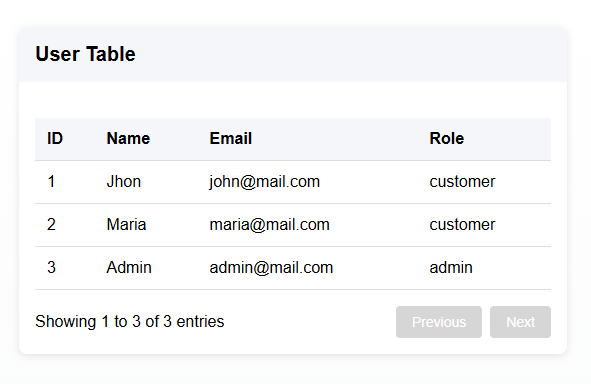

# Proyecto: Listado de Usuarios

Este proyecto consiste en consumir una API pública para mostrar un listado de usuarios en una tabla interactiva. Utilizando Angular.

---

## Descripción de la Práctica

1. Consumir la API pública: `https://api.escuelajs.co/api/v1/users`.
2. Mostrar el listado de usuarios en una tabla.

---


## Vista del Listado de Usuarios



---

## Ejecucion de la aplicacion de manera local

Clona el repositorio

```bash
  git clone https://github.com/BladimirGS/consumo-api-GSHB.git
```

Vamos a la carpeta del proyecto

```bash
  cd consumo-api-GSHB
```

Instalamos dependencias

```bash
  npm install
```

Corremos el servidor de manera loca

```bash
  ng serve
```

---
